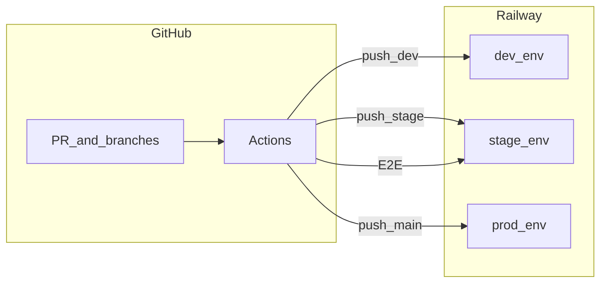

# Technical setup: repo, Railway, GitHub Actions

## Goals (from your notes)

- **Monorepo:** `apps/web`, `apps/api`, later `tests/e2e`; one PR for app + tests ([TECH_STACK.md](notes/TECH_STACK.md)).
- **Branches → environments:** `dev` → dev deploy (auto on push), `stage` → stage deploy + E2E against URL, `main` → prod deploy + smoke ([TECH_STACK.md](notes/TECH_STACK.md), [features_development.plan.md](notes/features_development.plan.md)).
- **Every PR:** fast checks (lint, unit/API tests). **Stage:** deploy + E2E. **Prod:** lighter smoke after deploy.
- **Deploy:** Railway (API + Postgres plugin; static web first). **Migrations** run on each deploy.

---

## 1. Repository structure (before or as part of Phase 1)

Create a minimal **pnpm workspace** at the repo root (matches “pnpm/npm” in your notes; pnpm scales better for monorepos):

- `apps/web` — Vue 3 + Vite (build → static assets).
- `apps/api` — HTTP API + migration runner (framework TBD in code; keep CI commands as `pnpm --filter api …`).
- `tests/e2e` — Playwright (or Cypress) added when you wire stage E2E.
- Root: `pnpm-workspace.yaml`, root `package.json` with shared scripts (`lint`, `test`, `build`).
- `docker-compose.yml` at repo root: Postgres only (or Postgres + API for local parity) per Phase 1 in [features_development.plan.md](notes/features_development.plan.md).

**Branch model:** keep `main` as production; use `dev` and `stage` as long-lived integration branches (your table). Default branch can stay `dev` while iterating; protect `main` when you start prod deploys.

---

## 2. Railway setup (three environments)

**Recommendation:** **one Railway project** with **three Railway environments** (`development`, `staging`, `production`) rather than three separate projects—simpler linking from CI and mirrors GitHub Environments. Alternative (also in your notes): **three Railway projects** (dev/stage/prod)—use if you want hard isolation and separate billing caps.

Per environment, provision:

| Piece | Purpose |
|--------|--------|
| **Postgres** | Plugin; Railway injects `DATABASE_URL` (or equivalent) into linked services. |
| **API service** | Builds from `apps/api` (Nixpacks or Dockerfile). Start command runs the server. |
| **Static site (web)** | Build `apps/web` → deploy `dist` as **Static** service (Railway static hosting). |

**Configuration checklist (each env):**

- **API:** `DATABASE_URL` from Postgres plugin attachment; **JWT secret** and any auth vars; **CORS** allow the static site URL for that env; **API public URL** for the frontend (build-time `VITE_*` or runtime—prefer build-time for static sites).
- **Web:** Build command / output directory pointing at Vite’s `dist` under `apps/web`.
- **Networking:** Note the **stable public URLs** for `stage` (E2E) and `prod` (smoke); add custom domains later if needed.

**Migrations on deploy:** Prefer **one of**:

- **API start script:** `migrate && node server` (simplest; migrations always run before listen).
- **Separate Railway “deploy” hook** if your stack supports it.

Document the chosen command in README when Phase 1 lands.

---

## 3. GitHub repository infrastructure

**Branch protection (suggested):**

- `main`: require PR, status checks (`ci` workflow), optional required reviewers for prod alignment with [TECH_STACK.md](notes/TECH_STACK.md).
- `stage` / `dev`: require PR optional; at minimum run CI on PRs.

**GitHub Environments** (names should match what you put in workflows):

- `development`, `staging`, `production` (or `dev`/`stage`/`prod`—stay consistent everywhere).

**Secrets (typical):**

| Secret | Used for |
|--------|----------|
| `RAILWAY_TOKEN` | Railway API/CLI deploy from Actions ([Railway tokens](https://docs.railway.com/guides/cli#authentication)) |
| Railway project/environment IDs | Non-interactive `railway` CLI or HTTP API calls (store as repo or env secrets) |
| Stage E2E | `E2E_BASE_URL`, test user creds if not seeded-only (prefer seed script per [features_development.plan.md](notes/features_development.plan.md)) |

Optional: **Railway GitHub integration** (auto-deploy on push) *instead of* CLI—then Actions only runs tests and you rely on Railway for deploy. Your notes prefer **explicit CI + migrations**; the hybrid is **Actions runs tests → then triggers deploy** (CLI or `workflow_dispatch`) so deploys never skip green checks.

---

## 4. GitHub Actions workflows (concrete split)

**Workflow A — `ci.yml` (fast feedback)**

- Triggers: `pull_request`, `push` to `dev`, `stage`, `main`.
- Jobs: install (pnpm cache), **lint**, **unit/API tests** for `apps/api`, **build** `apps/web` + `apps/api` (proves compile). No Postgres in job unless API tests need it—if they do, add **service container Postgres** ([GitHub docs](https://docs.github.com/en/actions/using-containerized-services/creating-postgresql-service-containers)) or `docker compose up -d` for the test step only.

**Workflow B — `deploy-development.yml`**

- Trigger: `push` to `dev` (paths filter optional: `apps/**`, `packages/**`, workflow file).
- Needs: `ci` success (workflow_run or duplicate fast job—your choice).
- Job: deploy API + static to Railway **development** env using token + IDs; ensure migration runs via API startup or explicit step.

**Workflow C — `deploy-staging.yml`**

- Trigger: `push` to `stage`.
- Jobs: (1) deploy to **staging**, (2) **E2E** against `E2E_BASE_URL` (staging), with retries only where flaky tests warrant it.

**Workflow D — `deploy-production.yml`**

- Trigger: `push` to `main` or `release` tags (pick one policy and stick to it).
- Jobs: deploy **production**, then **smoke** subset (health + login or critical path).

Use **`concurrency` groups** per environment so two pushes do not interleave deploys.

---

## 5. Local dev parity

- `docker compose up` for Postgres; API connects to `localhost` DB; web uses Vite proxy to API or explicit `VITE_API_URL`.
- Document in README: clone → `pnpm i` → `compose up` → `pnpm dev` (or per-app scripts).

---

## 6. Order of implementation (minimal friction)

1. Add **pnpm workspace** + empty `apps/web` / `apps/api` placeholders (or wait until Phase 1 code exists—CI can still build once package.json exists).
2. **Docker Compose** + first API migration tool choice (Prisma / Drizzle / Knex—decide in Phase 1).
3. **Railway:** create project, three envs, Postgres + API + static per env; verify manual deploy from local once.
4. **GitHub Environments + secrets**; ship **`ci.yml`** first (green on default branch).
5. Add **deploy workflows** one env at a time (`dev` → `stage` → `main`).
6. Add **stage seed** script + E2E job when `tests/e2e` exists.

---

## 7. Optional diagram (mental model)

---

## Clarifications you can defer

- **Exact Railway CLI vs HTTP API:** both work with `RAILWAY_TOKEN`; CLI is often faster to wire in Actions.
- **Preview deployments per PR:** out of scope for “cheap demo” unless you add Railway PR environments later ([TECH_STACK.md](notes/TECH_STACK.md)).

This plan stays aligned with [app_design.md](notes/app_design.md) (product scope) without prescribing backend framework beyond “API + DB + JWT later.”
